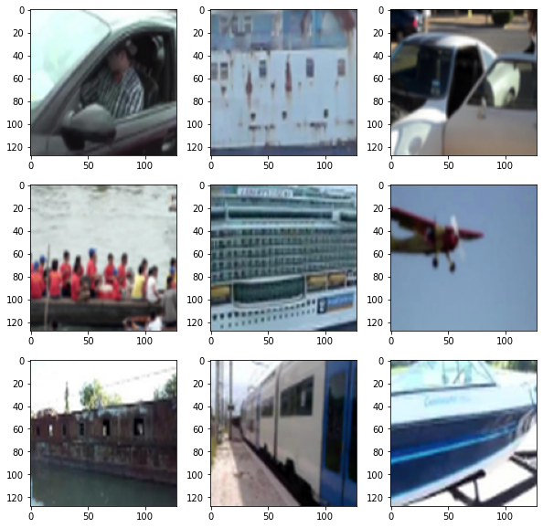

# Captcha cracker
Implementation of the freelance task solution from KWork, to create a solution for bypassing captcha using a neural network by contacting through ZennoPoster.

Captcha recognition is carried out using a pretrained neural network, which has been tuned for captcha images.

Asynchronous server operation is implemented using Celery and Flask.

1. [Scripts during development](development/)
2. [Scripts for retraining the model](deployment/retraining/)
3. [Scripts for working on the server](deployment/server/)

## Example data
<h1 align="center">
  
</h1>
